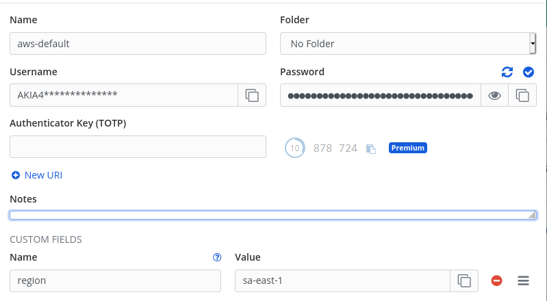

# AWS-BITWARDEN

Script para conectar na AWS através das credenciais armazenadas em um cofre do bitwarden.

## Pre-requisitos

- Instalar [aws-cli](https://docs.aws.amazon.com/cli/latest/userguide/install-cliv2-linux.html#cliv2-linux-install)
- Instalar [bw cli](https://bitwarden.com/help/article/cli/)



Onde:
  - Profile: Nome do item no cofre
  - `AWS_ACCESS_KEY_ID=Username`
  - `AWS_SECRET_ACCESS_KEY=Password`
  - `AWS_DEFAULT_REGION=[region value]`

## Como executar

```
  $ gh repo clone swirfneblin/aws-bitwarden
  $ cd aws-bitwarden
  $ mv awsprofile.sh /usr/local/bin
```
```
  $ source awsprofile.sh aws-default
```